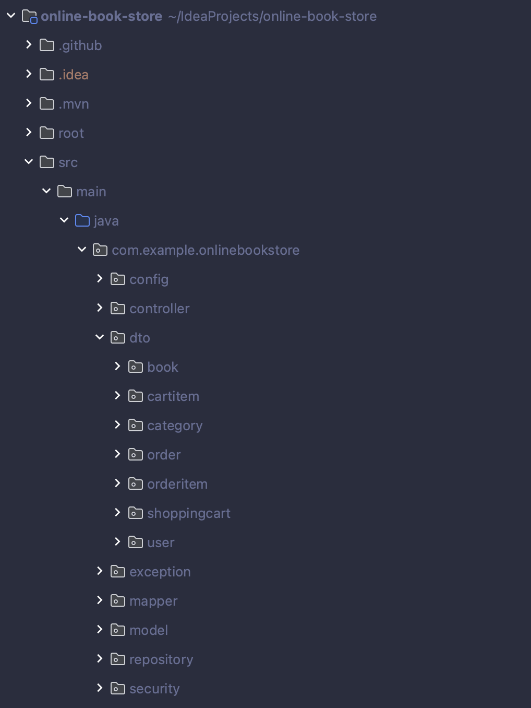
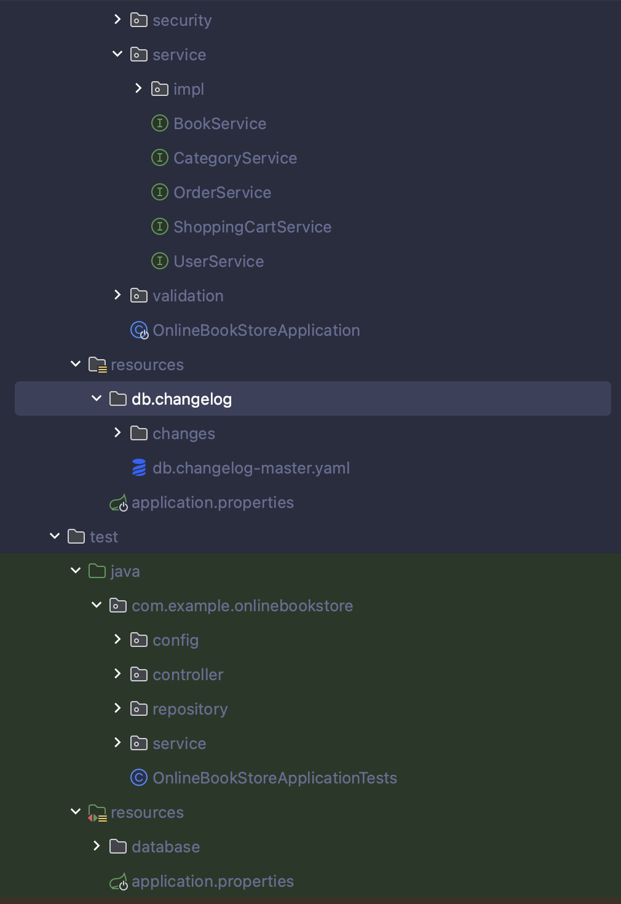
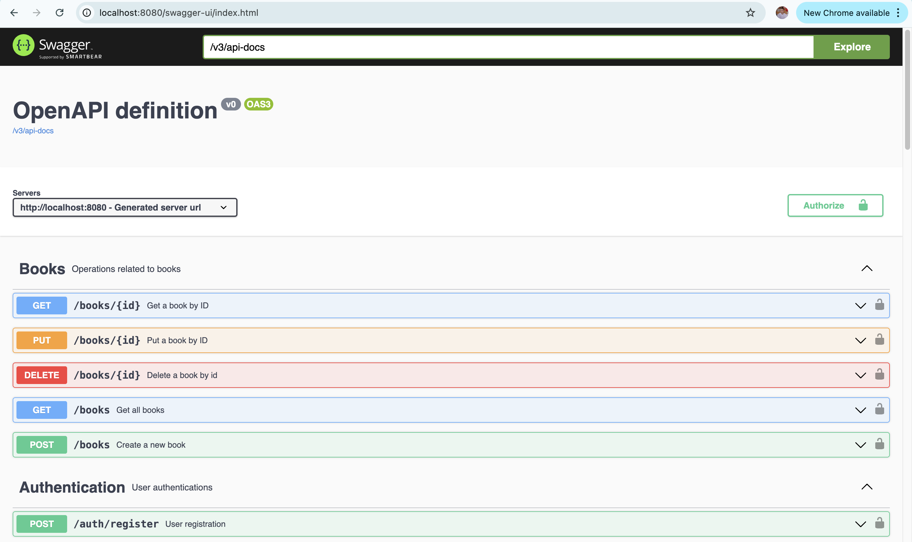

# Online Book Store

## Introduction
The Online Book Store is a modern web application designed to streamline the process of purchasing books online. This platform was created to simplify book shopping for users while providing store owners with an efficient way to manage their inventory and sales. It addresses challenges like accessibility, secure transactions, and user engagement through a seamless interface and robust backend technologies.

## Features
- **User Management**: Secure registration, login, and role-based access (USER, ADMIN).
- **Book Catalog**: Search, filter, and browse through an extensive catalog of books.
- **Categories**: Group books by categories for easy navigation.
- **Shopping Cart**: Add, remove, and view items in the cart.
- **Order Processing**: Create and view orders with detailed summaries.
- **Security**: Implements JWT-based authentication and BCrypt password encryption.
- **API Documentation**: Swagger UI for comprehensive API documentation.

## Technologies Used
- **Backend**:
  - Spring Boot
  - Spring Security
  - Spring Data JPA
  - Liquibase
  - PostgreSQL
- **Testing**:
  - JUnit
  - Mockito
  - Testcontainers
- **Documentation**:
  - Swagger
- **Tools**:
  - Docker
  - IntelliJ IDEA
  - Maven

## Project Structure
The project is structured to ensure maintainability and scalability:
- **Controller Layer**: Handles incoming HTTP requests and interacts with services.
- **Service Layer**: Contains business logic and data processing.
- **Repository Layer**: Interfaces with the database using JPA.
- **Model**: Represents the core entities such as `Book`, `Category`, `User`, and `Order`.
- **Security**: Handles authentication, authorization, and JWT token management.
- **Validation**: Ensures data integrity using annotations and custom validators.

## Setup Instructions
### Requirements
- **JDK**: Ensure you have JDK 17 or later installed.
- **Docker**: Make sure Docker is installed and running on your machine.
- **Docker Compose**: Ensure Docker Compose is available for managing multi-container setups.

### Steps to Run the Project
1. Clone the repository:
   ```bash
   git clone https://github.com/Nazar090/online-book-store.git
   cd online-book-store
   ```
2. Build Docker containers and start the application:
   ```bash
   docker-compose up --build
   ```
3. Access the application:
   - Backend API: `http://localhost:8080`
   - Swagger UI: `http://localhost:8080/swagger-ui.html`

If you prefer to run the application locally without Docker, ensure the required database is running and configured, then use:
```bash
mvn spring-boot:run
```

## API Endpoints
### Authentication
- `POST /api/auth/register`: Register a new user.
- `POST /api/auth/login`: Authenticate and get a JWT token.

### Books
- `GET /api/books`: Retrieve a list of all books with pagination and sorting.
- `GET /api/books/{id}`: Retrieve details of a specific book by its ID.
- `POST /api/books`: Add a new book (ADMIN only).
- `PUT /api/books/{id}`: Update an existing book by ID (ADMIN only).
- `DELETE /api/books/{id}`: Delete a book by ID (ADMIN only).

### Categories
- `GET /api/categories`: Retrieve a list of all categories with pagination and sorting.
- `GET /api/categories/{id}`: Retrieve a specific category by its ID.
- `POST /api/categories`: Add a new category (ADMIN only).
- `PUT /api/categories/{id}`: Update an existing category by ID (ADMIN only).
- `DELETE /api/categories/{id}`: Delete a category by ID (ADMIN only).
- `GET /api/categories/{id}/books`: Retrieve all books in a category by category ID.

### Orders
- `POST /api/orders`: Place a new order.
- `GET /api/orders`: Retrieve all orders placed by the user.
- `GET /api/orders/{id}`: Retrieve details of a specific order by its ID.
- `GET /api/orders/{orderId}/items`: Retrieve all items within a specific order by order ID.
- `GET /api/orders/{orderId}/items/{id}`: Retrieve a specific item within an order by order ID and item ID.
- `PUT /api/orders/{id}`: Update the status of a specific order (ADMIN only).

### Shopping Cart
- `POST /api/cart`: Add an item to the shopping cart.
- `GET /api/cart`: Retrieve the shopping cart for the logged-in user.
- `PUT /api/cart/items/{cartItemId}`: Update the quantity of an item in the cart.
- `DELETE /api/cart/items/{cartItemId}`: Remove an item from the shopping cart by ID.

## Challenges and Solutions
1. **Data Security**: Implemented JWT and BCrypt to secure user data and authentication.
2. **Database Migration**: Used Liquibase for version-controlled schema management.
3. **Scalability**: Designed the application to support future feature expansions by adhering to clean architecture principles.

## Screenshots
- **Application Structure**:
  
  
- **Swagger UI**:
  

## Contributions
Contributions are welcome! Feel free to fork the repository and submit a pull request with your improvements.

---

Thank you for exploring the Online Book Store project.
